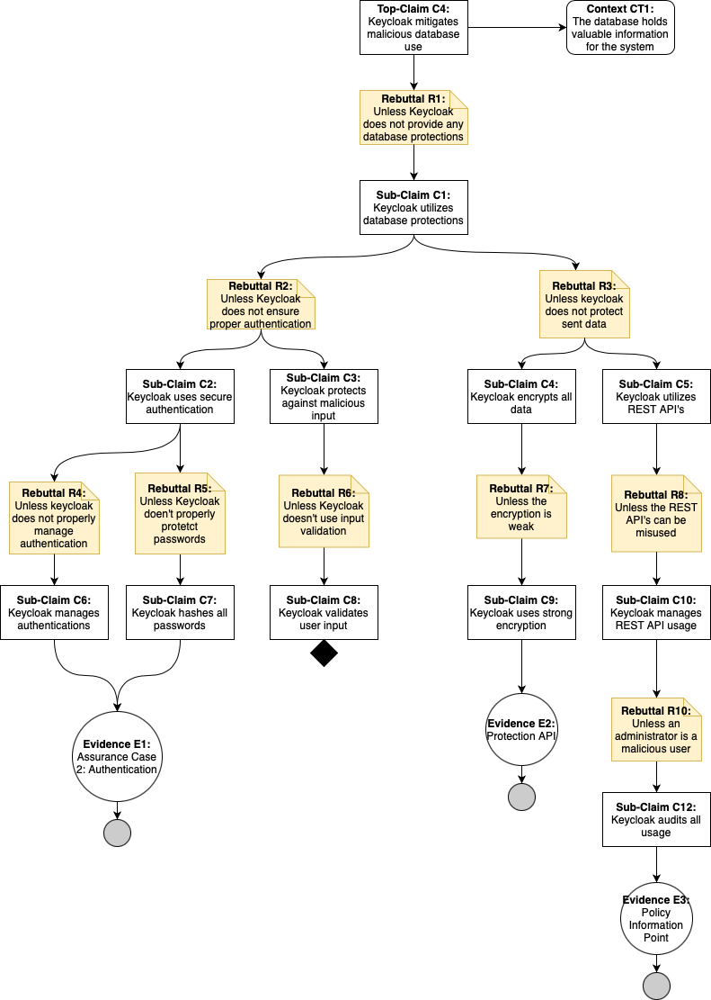

# Assurance Cases Report
Team OneWon
## Essential Interactions, Diagrams, and Alignment Analysis

### Assurance Case 1: Keycloak Prevents Man-In-The-Middle Attacks

Keycloak allows for integration between multiple platforms which can require credentials to be passed between endpoints.  Credential theft through network eavesdropping is a risk which can be eliminated using a properly configured truststore.  The truststore allows for encrypted SSL connections in order to protect user credentials.

E1:  Regular auditing of system logs are needed to protect the integrity of the truststore.  Should the truststore become compromised, the security of any SSL connection cannot be reliable.  A fraudulent or compromised certificate can allow for a rogue entity to impersonate an endpoint and gather user credentials.

E2:  A poor certificate using weak encryption can allow for easier credential interception.  SSL certificates should never be self-signed and always acquired from a trusted Certificate Authority using industry-standard RSA 2048-bit or higher key length.

### Assurance Case 2:  Keycloak ensures all users are authenticated before being allowed access to applications or other resources

Keycloak has many features, among which is the ability for an organization to utilize Keycloak and offload much of the overhead and resources required for properly secure user authentication.  If, however, an organization is going to entrust authentication to a 3rd party like Keycloak, there must exist sufficient assurance that their applications and resources will be safe from unauthenticated user interactions.  In direct response to this, Keycloak has a plethora of settings which, when properly utilized, will offer that assurance to an organization.

E1:  2FA Policy Review Report - An organization utilizing Keycloak must regularly conduct a review of the Two-Factor Authentication Policy in order to ensure that all users, existing and new, have the proper settings in the Keycloak dashboard in order to enforce the usage of 2FA for their accounts.  This will help mitigate phishing attempts and minimize damage caused by user credentials being gained externally to the system.

E2:  Passwords are stored quite safely in a hashed format utilizing a strong hashing algorithm (PBKDF2) with a default of 27,500 hashing iterations per hashed password.  Admins can tweak these settings if needed as this is can be resource intensive when adding many users at once but the default settings are best kept for security.  A combination of reviewing the source code and reviewing the settings in the Keycloak dashboard will ensure passwords are stored in a safe hashed format.

E3:  Regular reviews of Password Policy are strongly recommended in order to ensure users are using safe and strong passwords for their accounts.

E4:  Regular reviews are recommended of both the source code and the Keycloak dashboard settings in order to ensure that brute force detection is always in place and enforced at all times.

Conclusion and Gaps:  After thorough review of Keycloak documentation, there were **NO** gaps found in regards to user authentication.  Each of the pathways of attack has an answer provided by Keycloak accessed by an administrator through the dashboard.  Passwords are stored in hashed format using a strong hashing algorithm with many hashing iterations per hashed password.  Proper password use can be hard-enforced by Keycloak rather than recommended by administrators or organization management.  User passwords can be required to have a set minimum of characters (recommended minimum is 8, and a minimum greater than 14 is overkill) and can require special characters, numbers, capitals and lowercase characters.  Keycloak even stores a history of old passwords for each user and can prevent the reuse of those passwords within a determined time period.  Even brute force detection and 2FA have settings in the Keycloak dashboard that can mitigate and prevent unauthenticated access.

### Assurance Case 3: Keycloak Prevents Unauthorized Access to Clients

One of Keycloak's key features is its ability to assign access to clients (applications). Once one or more applications are assigned to a user, varying roles governing permissions within those applications can also be assigned. For example, a bank using Keycloak may provide a customer with access that would come standard to any user with a checking account, but that user may also be assigned higher levels of access depending on what features the user requires. Perhaps in addition to the checking account, the user is granted the ability to utilize a wire transfer feature, or trading permissions for a 401k. Whatever the business reasoning, it is essential that role based access within Keycloak cannot be circumvented. This case assurance case aims to address that concern.

E1: Assurance case 2 serves as evidence that authentication in Keycloak is secure, as long as all recommendations and associated evidence found within are followed, and appropriate action is taken during initial setup of the Keycloak server. 

E2: Authorization Policy review report - Should consist of a periodic check to ensure that authorization policies are enabled, and set to "enforcing" mode. In addition to these settings, it is recommended that an authorization policy review report check that all resources within Keycloak have policies associated with them. It serves no purpose if policy enforcement is enabled, but no policy exists to enforce. 

E3: Zero Trust Architecture Report - It is strongly recommended that any organization using Keycloak adopt a zero trust architecture for their user roles. In other words, each user should have exactly the access they need and no more. This means that each new user should start with absolutely no access to any clients. Instead, new users should only receive access to those applications necessary to perform any required actions, and that only those roles with the necessary permissions are assigned within the applications. Under no circumstances should default applications / roles / permissions be automatically assigned to new users unless it is deemed that the default applications / roles / permissions are essential for all possible users within the organization. 

E4: Server Security Review Report - While ensuring the right users have the right access is critical to authorization, it is equally critical that authorization be transmitted securely. Most of the required action for ensuring secure transmission of authorization should be addressed when a Keycloak realm is initially set up. Settings that enforce authorization token security and transmission of data via SSL/HTTPs are found within the admin console of each realm. The purpose of the Server Security Review Report is to periodically check to ascertain that proper security settings are enabled for the master realm and any sub-realm an organization has created within Keycloak.

E5: Assurance Case 1 works in parallel with the Server Security Report to serve as evidence of secure transmission of user authorization, as long as all recommendations and associated evidence found within are followed, and appropriate action is taken during initial setup of the Keycloak server.

Conclusion and Gaps: Since Keycloak's primary function is authentication and authorization, it does not come as much of a surprise that no gaps were identified within this assurance case. Keycloak provides all of the necessary tools to prevent users from circumventing authorization, but it is up to administrative users within an organization to turn on optional settings like SSL/HTTPS and to ensure that the right roles and authorization policies are created to make use of these tools. Keycloak cannot protect organizations from their own bad policies, failure to comply with best practices (like zero trust), or failure to change default settings inside of Keycloak after initial set up.

### Assurance Case 4:

Keycloak needs the use of databses for various reasons, and as such, the mitigation of the misuse of a database is needed. From input validation to properly hashed passwords, Keycloak needs to protect against all types of attacks against it.

E1: The evidence here is directly related to the main-in-the-middle attacks, with proper user authentication needed. This evidence is also directly related to Assurance Case 2 as well.

E2: All passwords utilize the SHA256 Hash, which is known to be a strong hashing algorithm.

E3: The protection API helps encrypt and send protected data.

E4: The Policy Information Point, is a point on keycloak's architecture that is directly related to auditing all the events that happen within keycloak.

Conclusion and Gaps: While keycloak does mitigate database misuse, keycloak does not use a database a whole lot. One gap comes with the Protection API. While, this API does help protect the data, it is encrypted with BASE64 and can still be susceptible to man-in-the-middle attacks. 

### Assurance Case 5:Keycloak is sufficiently Available

As an SSO enabler, Keycloak needs to be available when end users need to authenticate. This fails either when the server crashes (Administrator Side) or the Program breaks (Developer Side).

E1: This Evidence is part of Organizational policies that do not need to addressed by Keycloak Developement, though it is a good thing to keep in mind. As such this is not a gap.

E2: See E1.
 
E3: See E1.

E4: The bug fix ledger is essentially the difference between open bugs and resolved bugs. For Keycloak this is synonomous with their issues tab in GitHub. As of 10/9/22 @12PM, All their critical bugs are fixed as evident [here](https://github.com/keycloak/keycloak/issues?q=is%3Aissue+is%3Aclosed+label%3Apriority%2Fcritical+label%3Akind%2Fbug).

E5:This evidence along with E6 and E7 are related. Keycloak has 2 centralized Unit Test files, one for [Configuration](https://github.com/keycloak/keycloak/blob/main/quarkus/runtime/src/test/java/org/keycloak/quarkus/runtime/configuration/test/ConfigurationTest.java) and one for [RegEx](https://github.com/keycloak/keycloak/blob/main/quarkus/runtime/src/test/java/org/keycloak/quarkus/runtime/configuration/test/ConfigRegExPatternMatchingTest.java). If the problem occurs outside of those categories the Keycloak repo has no dedicated spots to work on additional Unit Tests. This could been seen as a partial gap.

E6: This evidence shows that an Edge case is added as a unit test. This can be determined by checking the commit history of the centralized Unit Test files.

E7: There is no centralized documentation for what the Unit Test files include. However, it could be deduced by looking at the test names. This is a potential gap.

E8: This evidence is related to E4. The documentation for bug fixes can be found via the Keycloak repo's [closed issues](https://github.com/keycloak/keycloak/issues?q=is%3Aissue+is%3Aclosed).

Conclusion and Gaps: After reviewing Keycloak's documentation and repo, there was 1 partial gap discovered with Unit Test and a potential gap with Unit Test documentation.

## Reflection

This portion of the project we initially found similar difficulties as we did last time.  Where last time we had some difficulty in deciding on use cases, this time we had some difficulty in narrowing down our top level assurance claims.  After internal communication and meeting with Dr. Gandhi we were able to select top level claims that we were familiar enough to be able to research them quickly, but would also fit the assignment requirements.  We divided labor quite similarly for the Assurance claims as we did with security requirements, where each member took a claim, completed a diagram, and searched for gaps between the claims and what Keycloak offers.  At this point in the project we feel like we've settled into comfortable semi-recurring roles where any difficulties are brought before the entire group for discussion, review, and if required any corrections.
