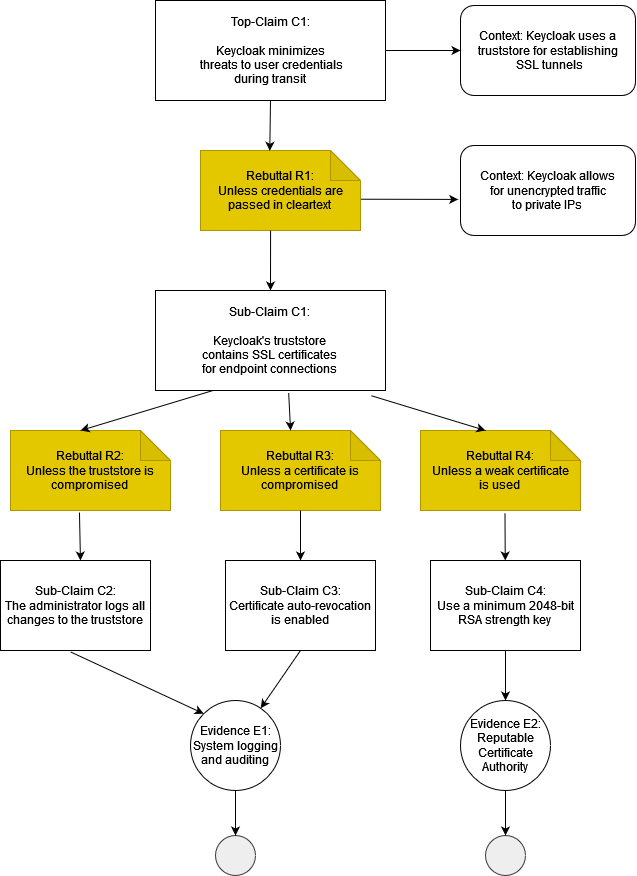
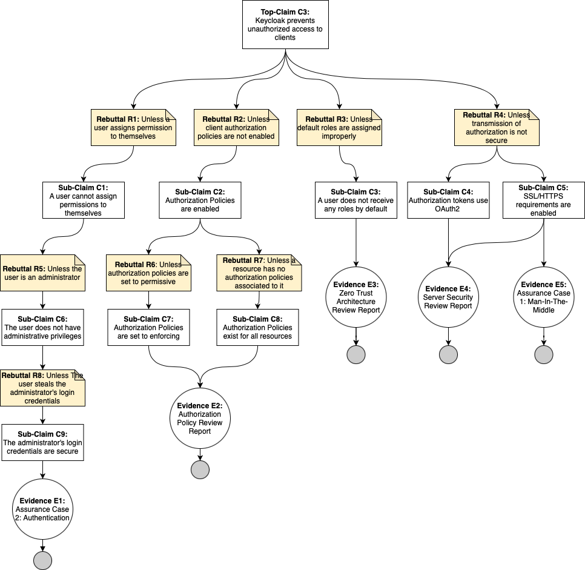
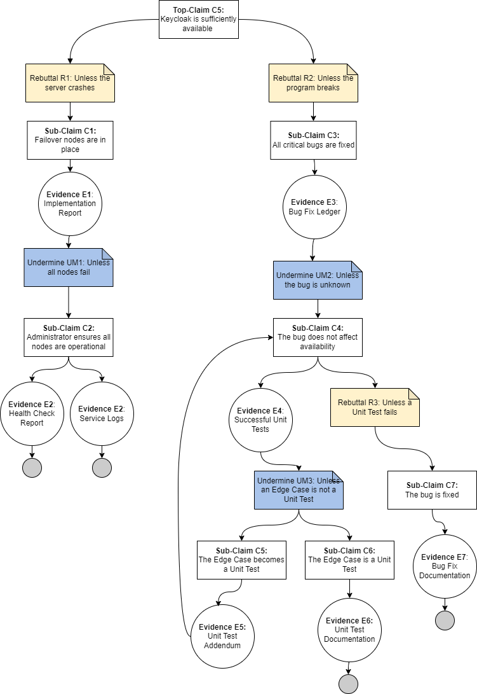

# Assurance Cases Report
Team OneWon
## Essential Interactions, Diagrams, and Alignment Analysis

### Assurance Case 1: Keycloak Prevents Man-In-The-Middle Attacks

Keycloak allows for integration between multiple platforms which can require credentials to be passed between endpoints.  Credential theft through network eavesdropping is a risk which can be eliminated using a properly configured truststore.  The truststore allows for encrypted SSL connections in order to protect user credentials.

E1:  Regular auditing of system logs are needed to protect the integrity of the truststore.  Should the truststore become compromised, the security of any SSL connection cannot be reliable.  A fraudulent or compromised certificate can allow for a rogue entity to impersonate an endpoint and gather user credentials.

E2:  A poor certificate using weak encryption can allow for easier credential interception.  SSL certicates should never be self-signed and always acquired from a trusted Certificate Authority using industry-standard RSA 2048-bit or higher key length.

### Assurance Case 2:  Keycloak ensures all users are authenticated before being allowed access to applications or other resources

### Assurance Case 3: Keycloak Prevents Unauthorized Access to Clients

### Assurance Case 4:

### Assurance Case 5:KeyCloak is sufficiently Available

## Reflection
