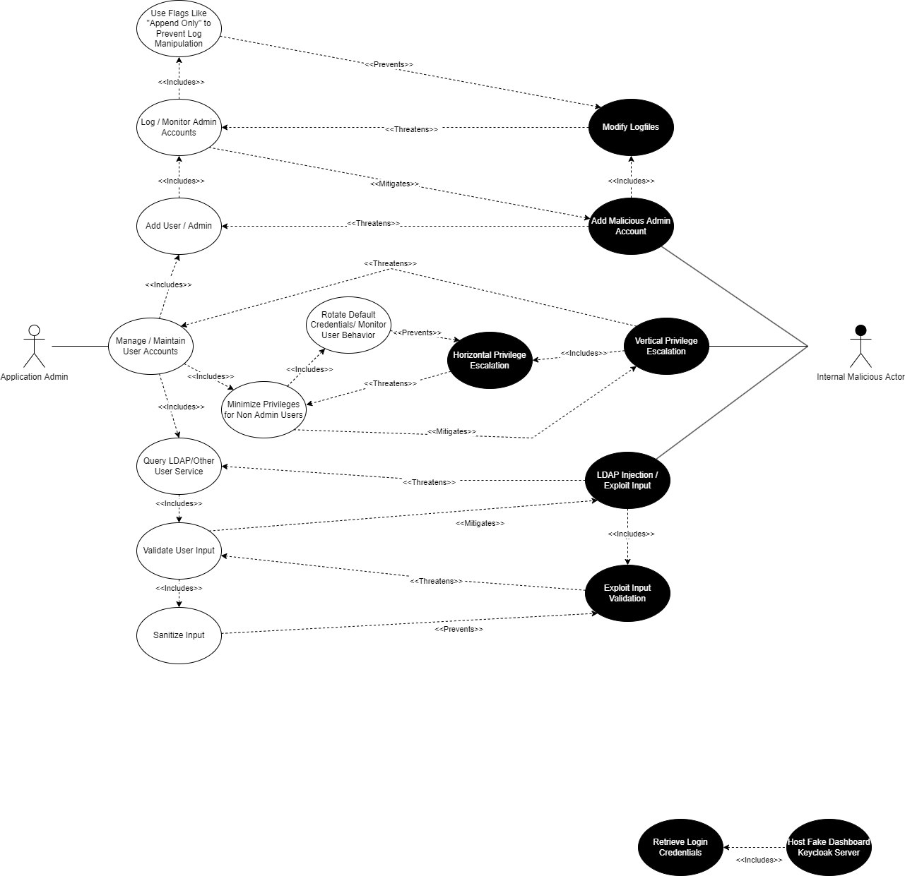

# Security Requirements Report
Team OneWon
## Essential Interactions, Diagrams, and Alignment Analysis

### Use Case 1: Implementing a Truststore

#### Description

The truststore is a foundational part of the Keycloak mechanism for remote connections.  Any Keycloak implementation that will connect to external systems will need the certificate of any external server to establish a secure SSL connection.  Remote server or Certificate Authority certificates must be stored in order to validate identity.  This validation is needed to prevent man-in-the-middle attacks.

#### Use Case

In this case, a non-privledged user will connect to an external server using Keycloak.  The user expects to connect to the external server without issue and without risk of credential theft.  The user believes proper care has been taken to configure the system and underlying security in order to connect to the expected endpoint.  Server configuration should be for maximum security to prevent any security breach from external entities.

#### Misuse Case

In reality, a hacker may attempt to infiltrate the Keycloak server and the hacker's goals may not be immediately apparent.  For example, curiousity may be a motivating factor which leads to an opportunistic security breach.  Should the Keycloak server be attacked, layers of security should be in place to maintain the integrity of the truststore.  Using a strong truststore password will eliminate the possibly of the bad actor altering the truststore file.  Similarly, a security certificate must be swiftly revoked from the truststore should a remote server's certificate become compromised.  Regular logging and auditing will eliminate these potential security risks.  The hacker may attempt to alter or delete logs to cover any trace of their presence in the system.  An alerting feature may be configured to notify administrators of mass file changes within the system.

#### Security Requirement

The Keycloak truststore is created and maintained using the pre-built Java "keytool" utility, therefore the truststore utilizes the underlying security of keytool.  The truststore password will be embedded into web applications that make use of the truststore for connection purposes.  Only administrators should have access to the embedded password, and robust system security is necessary to prevent external hackers from accessing the password.  Regular system logging and auditing should be conducted to monitor for any truststore changes.  Additionally, a file hash fingerprint should be recorded before and after any truststore changes to audit for any unrecorded changes to the file.

### Use Case 2: Creating a Realm

#### Description

Realms are the base level structure inside of Keycloak. Realms manage users in a given domain, what applications are assigned to those users, and what permissions the users have inside of those applications. The Master Realm is provided by Keycloak upon initial setup. The administrator of the master realm is the only individual with authority to create and manage other realms in the environment. Realms separate the authority of various administrators. For example, the Master Admin may choose to create an employee realm, a customer realm, and a contractor realm. The authority of each sub-realm administrator only extends to users/application inside of their realm.

#### Use Case

In this use case, the master administrator has created a sub-realm. While doing so, the master admin will manage the sub-realm admin account (assigning the role to a separate user if applicable). The master admin will also go on to add standard users (handled in a separate case) and assign them applications and permissions. Optionally, the new realm can be configured according to specific security requirements. Creating cryptographic realm keys is a base level security measure required by all realms. Optionally, the admin can choose to require SSL/HHTPS connections and establish a brute force detection policy that defines what a brute force attack looks like, and how they should be handled. 

#### Misuse Case

In this misuse case the bad actor is a malicious standard user who wishes to assign new applications to their role and/or escalate their current application permissions. Because it is the path of least resistance, the malicious user will first attempt to change permission settings from their own account. Because the standard user does not have administrative privileges, their attempt to edit their own permissions will fail and they will have to resort to more complex methods of achieving their goal. 
The next logical step for the attacker will be to obtain administrator privileges within their realm. The simplest way to achieve this goal would be to phish the sub-realm administrator’s login information. This can be mitigated by configuring the Keycloak sub-realm to use multi-factor authentication. Another more complex method would be to initiate a man in the middle attack to obtain the administrative user’s password. Since cryptographic realm keys are required with Keycloak, this risk is mitigated by default. This risk is further mitigated if the administrative user has added an SSL/HTTPS requirement in the realm’s security settings.
Finally, a user could choose to write a script to brute force the administrator’s password. If the administrator established a brute force detection policy, this risk will be mitigated. However, because brute force detection is optional, not establishing a brute force detection policy would offer the attacker their highest probability of success. 

#### Security Requirement

TODO

### Use Case 3

### Use Case 4

### Use Case 5

### Reflection on Security Requirements

## OSS Project Documention Review

## Overall Planning and Reflection
