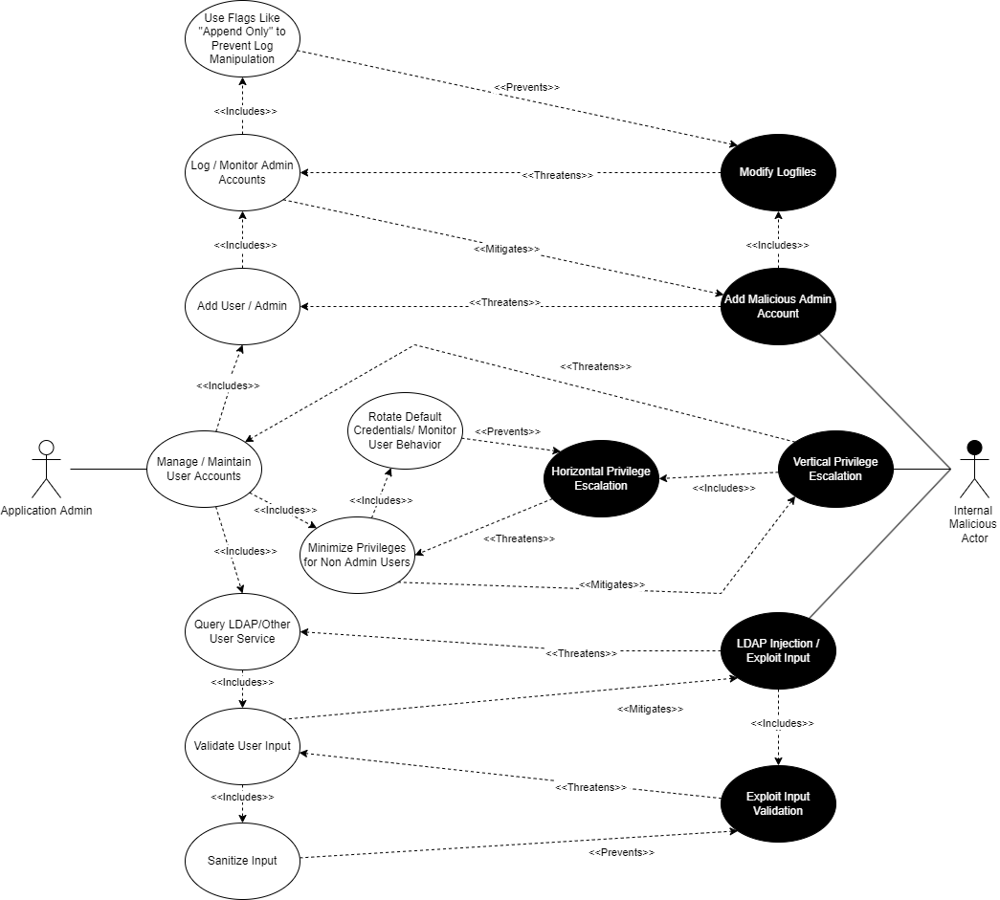

# Security Requirements Report
Team OneWon
## Essential Interactions, Diagrams, and Alignment Analysis

### Use Case 1: Implementing a Truststore

#### Description

The truststore is a foundational part of the Keycloak mechanism for remote connections.  Any Keycloak implementation that will connect to external systems will need the certificate of any external server to establish a secure SSL connection.  Remote server or Certificate Authority certificates must be stored in order to validate identity.  This validation is needed to prevent man-in-the-middle attacks.

#### Use Case

In this case, a non-privileged user will connect to an external server using Keycloak.  The user expects to connect to the external server without issue and without risk of credential theft.  The user believes proper care has been taken to configure the system and underlying security in order to connect to the expected endpoint.  Server configuration should be for maximum security to prevent any security breach from external entities.

#### Misuse Case

In reality, a hacker may attempt to infiltrate the Keycloak server and the hacker's goals may not be immediately apparent.  For example, curiosity may be a motivating factor which leads to an opportunistic security breach.  Should the Keycloak server be attacked, layers of security should be in place to maintain the integrity of the truststore.  Using a strong truststore password will eliminate the possibly of the bad actor altering the truststore file.  Similarly, a security certificate must be swiftly revoked from the truststore should a remote server's certificate become compromised.  Regular logging and auditing will eliminate these potential security risks.  The hacker may attempt to alter or delete logs to cover any trace of their presence in the system.  An alerting feature may be configured to notify administrators of mass file changes within the system.

#### Security Requirement

The Keycloak truststore is created and maintained using the pre-built Java "keytool" utility, therefore the truststore utilizes the underlying security of keytool.  The truststore password will be embedded into web applications that make use of the truststore for connection purposes.  Only administrators should have access to the embedded password, and robust system security is necessary to prevent external hackers from accessing the password.  Regular system logging and auditing should be conducted to monitor for any truststore changes.  Additionally, a file hash fingerprint should be recorded before and after any truststore changes to audit for any unrecorded changes to the file.

### Use Case 2: Creating a Realm

#### Description

Realms are the base level structure inside of Keycloak. Realms manage users in a given domain, what applications are assigned to those users, and what permissions the users have inside of those applications. The Master Realm is provided by Keycloak upon initial setup. The administrator of the master realm is the only individual with authority to create and manage other realms in the environment. Realms separate the authority of various administrators. For example, the Master Admin may choose to create an employee realm, a customer realm, and a contractor realm. The authority of each sub-realm administrator only extends to users/application inside of their realm.

#### Use Case

In this use case, the master administrator has created a sub-realm. While doing so, the master admin will manage the sub-realm admin account (assigning the role to a separate user if applicable). The master admin will also go on to add standard users (handled in a separate case) and assign them applications and permissions. Optionally, the new realm can be configured according to specific security requirements. Creating cryptographic realm keys is a base level security measure required by all realms. Optionally, the admin can choose to require SSL/HHTPS connections and establish a brute force detection policy that defines what a brute force attack looks like, and how they should be handled. 

#### Misuse Case

In this misuse case the bad actor is a malicious standard user who wishes to assign new applications to their role and/or escalate their current application permissions. Because it is the path of least resistance, the malicious user will first attempt to change permission settings from their own account. Because the standard user does not have administrative privileges, their attempt to edit their own permissions will fail and they will have to resort to more complex methods of achieving their goal. 
The next logical step for the attacker will be to obtain administrator privileges within their realm. The simplest way to achieve this goal would be to phish the sub-realm administrator’s login information. This can be mitigated by configuring the Keycloak sub-realm to use multi-factor authentication. Another more complex method would be to initiate a man in the middle attack to obtain the administrative user’s password. Since cryptographic realm keys are required with Keycloak, this risk is mitigated by default. This risk is further mitigated if the administrative user has added an SSL/HTTPS requirement in the realm’s security settings.
Finally, a user could choose to write a script to brute force the administrator’s password. If the administrator established a brute force detection policy, this risk will be mitigated. However, because brute force detection is optional, not establishing a brute force detection policy would offer the attacker their highest probability of success. 

#### Security Requirement
It is absolutely essential that Keycloak administrators take security precautions that are not enabled by default. First and foremost, brute force detection should be activated and the maximum number of unsuccessful login attempts should be set a reasonable number, three to five should be sufficient (Max is thirty). Keycloak also offers a feature to notify administrators when the maximum number of login attempts has been reached and the account is locked, this too should be enabled. Additionally, Multi-factor authentication should be turned on to ensure that even if a rouge user is able to capture the administrator's login credentials, they would not be able to access the account successfully. Finally, requiring SSL/HTTPS will compliment the default security provided by cryptographic realm keys with is one of the only security measures Keycloak makes mandatory.

### Use Case 3:  User Management

#### Description
Proper user and admin account management is critical for any application and Keycloak offers a variety of ways to add, secure, and maintain a collection of authorized users.  Users can be added directly through the web interface dashboard by an admin, as well as via via shell commands or even queried via LDAP or another user database service.  Users can also be assigned a Realm at creation, or Realm affiliation can be changed later at the admin's discretion.  This scenario will explore ensuring your user accounts are created securely and not maliciously manipulated.

#### Use Case
The user in question for this scenario is a a system administrator in charge of adding and maintaining the user accounts for a system that has employed Keycloak for authorization.  The administrator will have the ability to add a user manually via the browser dashboard, and will have a variety of actions available in order to ensure that only authorized users are added and accounts aren't modified unless intended by the company.  Along with the ability to add a user directly, the administrator will have the option of using an LDAP service to retrieve users from an existing user database.  Finally, the administrator will maintain the integrity of the existing user base and ensure that accounts aren't gaining escalated privileges without authorization.

#### Misuse Case
On the Misuse side of this scenario, the attacker will be a rogue inside employee with user privileges.  The first line of attack will be to create a fake malicious account with access to internal assets.  This attack will be mitigated by maintaining logs showing when a user account is added or modified, when it is added or modified, and any particulars changed through the modification.  In response to logs, an attack may attempt to modify the logs in order to cover their tracks.  This in turn, can be prevented by ensuring that your logs allow appending data only so that log entries can be added but no entry can be modified.

Another route of attack may be to either elevate the privileges of the attackers account, or an accomplice's account.  This can be mitigated by ensuring that every user has the absolute minimum privilege status required to function in their company role.  In response an attacker may instead seek to escalate horizontally by attempting to gain control of a newly added user account that either has a very easy to crack password or worse yet still has a default issued password where a user hasn't logged in and changed the password to an individualized one yet.  The attack can be rebuffed here by ensuring that the default password is changed semi-regularly or rotated from an internal list of default passwords.  Administrators can also keep an eye on user behavior to catch any suspicious behavior.

Finally, in the case where user accounts are queried from an LDAP server, an attacker may wish to attempt a malicious LDAP injection attack in order to gain unauthorized access or other valuable information from the database.  This attack can be mitigated be including input validation in the user database software which may still have some vulnerabilities to exploit.  In order to ensure the LDAP server can't be attacked and a malicious user can't retrieve account information from the server, any and all user input must be both validated and sanitized.

#### Security Requirements
* Utilize logging to monitor the addition, deletion, and modification of user accounts and ensure the log files can only be appended to in order to disallow malicious modifications.
* Minimize privileges for all users with regard to ensuring they can complete their role in the company and ensure that default passwords aren't the same and left in place for long periods of time.
* Ensure that user input in regards to user database queries is always BOTH validated and sanitized.

### Use Case 4

### Use Case 5

### Reflection on Security Requirements

## OSS Project Documentation Review

Being that Keycloak is in the business of security, their security related documentation was fairly extensive. Keycloak has included many guides on their website describing various methods for setting the appropriate security measures based on the users need. 

[Server Administration Guide](https://www.keycloak.org/docs/latest/server_admin/index.html)

[Section 15](https://www.keycloak.org/docs/latest/server_admin/index.html#mitigating-security-threats) is dedicated entirely to mitigating security threats. There are a wide variety of security options available to users of Keycloak many of which are not turned on by default. Some of these features include: Brute force detection, Clickjack prevention, SSL/HTTPS requirements, and default PBKDF2 password hashing.

Keycloak also has documentation specifically focusing on securing the clients and service being integrated with Keycloak.

[Securing Applications and Services Guide](https://www.keycloak.org/docs/latest/securing_apps/index.html)

## Overall Planning and Reflection
